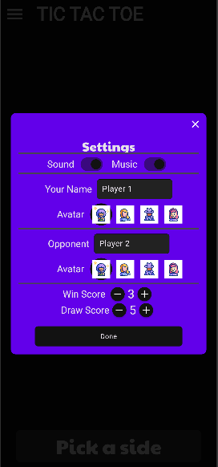

# Let's create the README file with an interesting and engaging description for the Tic-Tac-Toe game

readme_content = """
# Tic-Tac-Toe Flutter App 🎮

A simple yet addictive mobile game built with Flutter, where you can play the classic Tic-Tac-Toe with your friends, and soon even challenge the computer!

This app was created to practice my Flutter skills while building something fun that others can enjoy. It features a beautiful UI, sound effects, and customization options that will keep you entertained!

## Don't forget to give a star if you like this project 😅😊

### Note: This repository is still under development, so stay tuned for more features and improvements! 🙃

## Table of Contents 📜
- [General Info](#general-info)
- [Screenshots](#screenshots)
- [Getting Started](#getting-started)
- [Features](#features)
- [Technologies](#technologies)
- [Dependencies](#dependencies)
- [Contact Me](#contact-me)

## General Info 📝
Tic-Tac-Toe is a mobile game created with Flutter to challenge your friends or soon, even your mind. With responsive UI, fun animations, sound effects, and the ability to customize your player avatar, it's a fun way to pass the time!

The project is still in its early stages, and there are many more features in the pipeline to make it even more engaging.

## Screenshots 📷





## Getting Started 🚀

1. **Setup Flutter**  
   To start working with this project, you'll need to set up Flutter on your machine. Follow the official [Flutter setup guide](https://flutter.dev/docs/get-started/install).

2. **Clone the repository**  
   Clone this repository to your local machine by running:

   ```bash
   git clone https://github.com/your_username/TicTacToe.git
   cd TicTacToe/

3. **Install dependencies**
   Install the required dependencies:
   flutter pub get

4. **Run the app**
   Run the app on an emulator or real device:
   flutter run

## Current Features:
- **Responsive UI**: Whether you’re on a small phone or a tablet, this app scales beautifully.
- **Splash Screen**: Enjoy a smooth transition from the splash screen to the main game.
- **Background Music**: Relax with a soothing background track as you play.
- **Game Sounds**: Every move, win, and draw has a delightful sound effect to match.
- **Player Customization**: Players can change their name and avatar to make the game truly their own.
- **Score Customization**: Set the win and draw scores to your preference.
- **Game Timer**: Keep track of time while playing with a timer.
- **Smooth Animations**: From turn transitions to victory celebrations, enjoy visually appealing animations.

## Upcoming Features:
- **Data Storage**: Save your player settings, including avatars and preferences, using SharedPreferences.
- **Settings Showcase**: A neat widget on the Welcome Screen to showcase game settings.
- **AI Opponent**: Implement the Minimax algorithm to create a challenging computer opponent 🧠.
- **Multi-language Support**: Make the game accessible to people around the world with multiple languages.

## Technologies 👨🏻‍💻
- **Flutter**: The cross-platform framework used to build the app.
- **Dart**: The programming language used for app development.

## Dependencies 📚
- **Anitex**: A Flutter package for smooth and flexible UI transitions.
- **Lottie**: Add fun animations with this popular animation tool.
- **RFlutter Alert**: A simple package to create customizable alert dialogs.

## Contact Me 📞
**Vandana Kumari**

Feel free to reach out if you have any questions or want to contribute to the project!

- **Email**: vandanak.tech@gmail.com
- **LinkedIn**: [@Vandana](https://www.linkedin.com/in/vandanakumari0803/)
- **GitHub**: [@Vandana](https://github.com/vandana-kumari25)

If you enjoyed playing the game or want to contribute to this project, feel free to fork the repo and send pull requests. Let’s build something great together! 🎉